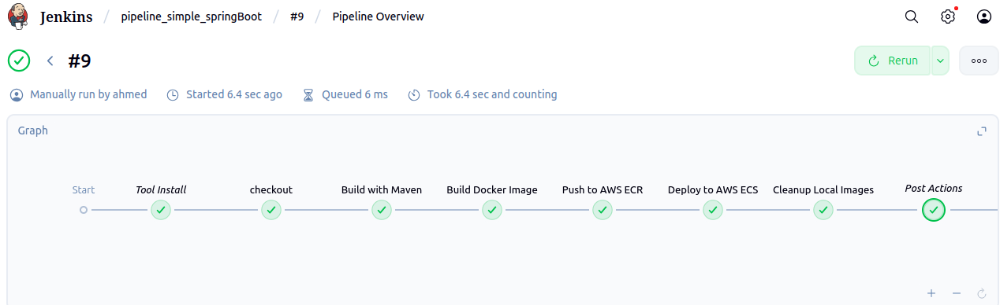

# Spring Boot CI/CD Pipeline with AWS ECS Deployment


## 📋 Overview

Automated **CI/CD pipeline** that builds, tests, containerizes, and deploys a Spring Boot application to AWS ECS with zero-downtime deployments.

**Pipeline:** `GitHub → Jenkins → Maven Build → Docker → AWS ECR → AWS ECS`

## 🛠️ Tech Stack

- **Application:** Java 17, Spring Boot 3.x, Maven
- **CI/CD:** Jenkins, Docker
- **Cloud:** AWS ECS (Fargate), AWS ECR, CloudWatch
- **Security:** AWS IAM, ECR Image Scanning

## ✨ Key Features

✅ Automated builds on every Git push (5-min polling)  
✅ Automated testing with Maven  
✅ Multi-stage Docker builds for optimized images  
✅ Zero-downtime rolling deployments  
✅ Automated rollback on failures  
✅ Build number tagging for traceability  
✅ CloudWatch logging and monitoring  

## 🚀 Quick Start

### Prerequisites

- Jenkins server with Docker support
- AWS account (ECR + ECS access)
- Java 17, Maven 3.6+, Docker

### Jenkins Setup

**1. Install Plugins:**
- Pipeline: AWS Steps
- Docker Pipeline
- Amazon ECR Plugin

**2. Configure AWS Credentials:**
- Go to: `Manage Jenkins → Credentials → Add Credentials`
- Type: AWS Credentials
- ID: `aws-credentials`
- Add your AWS Access Key and Secret Key

**3. Set Environment Variables:**

`Manage Jenkins → System → Environment variables`

| Variable | Example |
|----------|---------|
| `AWS_REGION` | `us-east-1` |
| `AWS_ACCOUNT_ID` | `123456789012` |
| `ECR_REPOSITORY` | `demoapp` |
| `ECS_CLUSTER` | `demo-cluster` |
| `ECS_SERVICE` | `demoapp-service` |

**Get your AWS Account ID:**
```bash
aws sts get-caller-identity --query Account --output text
```

**4. Configure Tools:**

`Manage Jenkins → Global Tool Configuration`

- **JDK:** Name: `jdk17`
- **Maven:** Name: `maven3`
- **Docker:** Name: `docker`

### AWS Infrastructure Setup

**1. Create ECR Repository:**
```bash
aws ecr create-repository --repository-name demoapp --region us-east-1
```

**2. Create ECS Cluster:**
```bash
aws ecs create-cluster --cluster-name demo-cluster --region us-east-1
```

**3. Create CloudWatch Log Group:**
```bash
aws logs create-log-group --log-group-name /ecs/demoapp --region us-east-1
```

**4. Create IAM Role for ECS:**
```bash
# Create role with trust policy for ecs-tasks.amazonaws.com
# Attach policy: AmazonECSTaskExecutionRolePolicy
```

**5. Create Task Definition:**

Save as `task-definition.json`:
```json
{
  "family": "demoapp-task",
  "networkMode": "awsvpc",
  "requiresCompatibilities": ["FARGATE"],
  "cpu": "256",
  "memory": "512",
  "executionRoleArn": "arn:aws:iam::YOUR_ACCOUNT_ID:role/ecsTaskExecutionRole",
  "containerDefinitions": [{
    "name": "demoapp",
    "image": "YOUR_ACCOUNT_ID.dkr.ecr.us-east-1.amazonaws.com/demoapp:latest",
    "portMappings": [{"containerPort": 9090, "protocol": "tcp"}],
    "essential": true,
    "logConfiguration": {
      "logDriver": "awslogs",
      "options": {
        "awslogs-group": "/ecs/demoapp",
        "awslogs-region": "us-east-1",
        "awslogs-stream-prefix": "ecs"
      }
    },
    "healthCheck": {
      "command": ["CMD-SHELL", "curl -f http://localhost:9090/actuator/health || exit 1"],
      "interval": 30,
      "timeout": 5,
      "retries": 3,
      "startPeriod": 60
    }
  }]
}
```

Register it:
```bash
aws ecs register-task-definition --cli-input-json file://task-definition.json
```

**6. Create ECS Service:**
```bash
aws ecs create-service \
  --cluster demo-cluster \
  --service-name demoapp-service \
  --task-definition demoapp-task \
  --desired-count 1 \
  --launch-type FARGATE \
  --network-configuration "awsvpcConfiguration={subnets=[subnet-xxx,subnet-yyy],securityGroups=[sg-xxx],assignPublicIp=ENABLED}"
```

## 📂 Project Structure
```
.
├── src/main/java/          # Java source code
├── src/main/resources/     # Application properties
├── src/test/java/          # Unit tests
├── Dockerfile              # Multi-stage Docker build
├── Jenkinsfile             # CI/CD pipeline definition
├── pom.xml                 # Maven configuration
```

## 🔄 Pipeline Stages

### 1. **Validate Configuration**
Checks that all required environment variables are set

### 2. **Checkout**
Pulls latest code from GitHub (auto-triggered every 5 mins)

### 3. **Build with Maven**
Compiles code, runs tests, packages as JAR

### 4. **Build Docker Image**
Creates optimized container image with build number tag

### 5. **Push to AWS ECR**
Uploads image to container registry with vulnerability scanning

### 6. **Deploy to AWS ECS**
Updates ECS service with zero-downtime rolling deployment

### 7. **Cleanup**
Removes local images to free disk space

**Total Time:** ~6-9 minutes

## 📸 Pipeline Execution

### Jenkins Pipeline View


*Complete pipeline execution showing all stages*

```